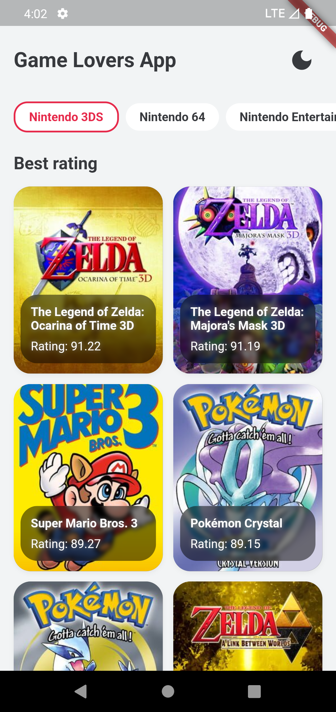
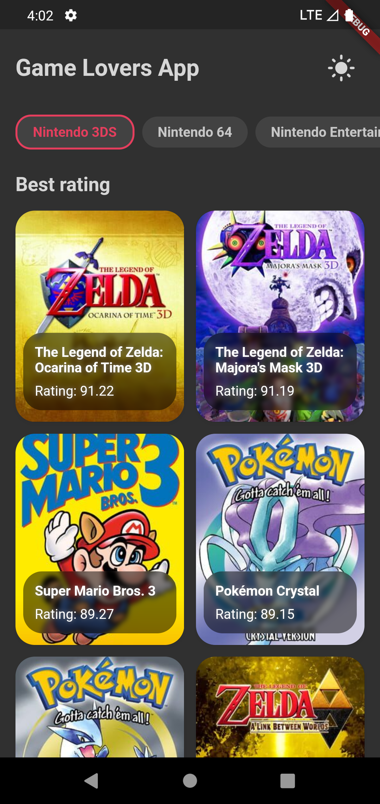

# Game Lovers App
Esse é um app desenvolvido em flutter/dart que lista os jogos da IGDB API

## Principais bibliotecas/tecnologias utilizadas
- Gerenciamento de estado: BLOC
- Injeção de dependências: Provider
- Requisições http: Dio
- Cache local de preferências: SharedPreferences
- Cache local da API: Drift/Moor
- Testes: Mockito, bloc_test

## Arquitetura
A arquitetura utilizada no app foi baseada na 
[Clean Dart](https://github.com/Flutterando/Clean-Dart)
(Proposta de Arquitetura Limpa da Flutterando)

## Testes
Foram implementados testes de unidade, widgets e integração

## Build/Tests
Passo 1: [Instale o Flutter](https://docs.flutter.dev/get-started/install)
(Versão utilizada no desenvolvimento: 3.3.6)

Passo 2: Baixe ou clone este repositório usando o link abaixo:
```
https://github.com/GerlanStanley/game_lovers.git
```

Passo 3: Vá para a raiz do projeto e execute o seguinte comando no console para obter as dependências necessárias:
```
flutter pub get
```

Passo 4: Este projeto utiliza bibliotecas que trabalha com geração de código, execute o seguinte comando para gerar os arquivos:
```
flutter packages pub run build_runner build --delete-conflicting-outputs
```

Passo 5: Para testes da lib Drift/Moor é necessário instalar a biblioteca sqlite3 no sistema:
<br>
- No macOS, ele é instalado por padrão.
  
- No Linux, você pode usar o pacote libsqlite3-dev no Ubuntu e o pacote sqlite3 no Arch (outras distribuições terão pacotes semelhantes).

- No Windows, você pode [baixar 'Binários pré-compilados para Windows'](https://www.sqlite.org/download.html) e extrair sqlite3.dll para uma pasta que está em sua variável de ambiente PATH. Em seguida, reinicie o dispositivo para garantir que todos os aplicativos sejam executados com essa alteração PATH.

## Screenshots
<p float="left">
    
     
</p>
<p float="left">
    
     
</p>